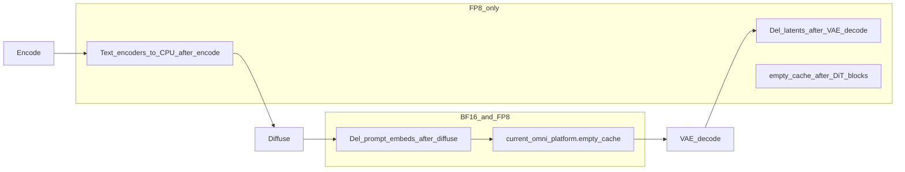

# PR：Stable Diffusion 3 DiT 在线 FP8 与显存路径清理

> 可直接复制以下各节到 GitHub PR 描述。提交前将 **`#<PR>`** 替换为实际 PR 号。

## Motivation

为 **Stable Diffusion 3** 管线中的 DiT（`SD3Transformer2DModel`）启用 **`--quantization fp8`** 时的在线动态 FP8，在可控画质损失下降低权重与部分前向显存；对注意力与上下文支路等敏感路径保持 BF16，与 Hunyuan 等对 attention 的保守策略一致。  
同步去掉 `diffuse` 内过密的 `empty_cache` / 每步 `del` 等难以向审稿人解释、且对数值无贡献的边缘逻辑，便于 PR 叙事与性能审计。

## Scope

- **仅 DiT（transformer）**：文本编码器与 VAE 仍为 FP32/BF16，与默认管线一致。
- **BF16 路径**：去噪循环不再插入 FP8 专用显存分支；并修复部分 GPU 上 **文本塔输出 `float16` 与 DiT `bfloat16` 混用** 导致的 `Input type (Half) and bias type (BFloat16)` 启动失败（条件 embedding 与初始噪声统一为 `od_config.dtype`）。

## Implementation summary

- DiT：注意力、`context_embedder`、`proj_out`、context 支路 `ff_context` 保持 BF16；图像支路 `ff` 仅 **down-proj** 走 FP8（`quantize_down_proj_only`）。
- FP8：`quant_config_is_fp8` 供 pipeline 判断；`_contiguous_if_needed` 减少无谓 contiguous。
- FP8：encode 完成后文本塔迁 CPU，依次 `current_omni_platform.empty_cache()` 与 `_sd3_fp8_maybe_empty_cuda_cache()`。
- 去噪结束后 `del` 条件 embedding + `empty_cache`（BF16/FP8 共用）。
- FP8：VAE decode 后 `del latents` + `_sd3_fp8_maybe_empty_cuda_cache`。
- FP8：DiT 在**全部** `transformer_blocks` 结束后**一次** `torch.cuda.empty_cache()`。

### 依赖关系（FP8 显存路径）



## VRAM（本机实测，供 PR 表格）

**环境**：NVIDIA GeForce RTX 5060 Ti，`768×768`，28 步，`guidance_scale=4.5`，`--vae-use-slicing --vae-use-tiling`，`--enforce-eager`，**同一风景 prompt**（与其它组命令见 `sd3_fp8_three_prompts.md`）。  
权重来源：**本地** `stable-diffusion-3-medium-diffusers` 快照（与 Hub `stabilityai/stable-diffusion-3-medium-diffusers` 等价；日志字段为 `Model loading took … GiB` 与单次请求的 `Peak GPU memory`）。

| 指标 | BF16 | FP8 | 节省（BF16 − FP8） |
|------|------|-----|---------------------|
| Model load (GiB) | 16.48 | 16.26 | ≈ 0.22 |
| Peak reserved (GB) | 18.88 | 16.38 | ≈ 2.50 |
| Peak allocated (GB) | 17.82 | 16.35 | ≈ 1.47 |

说明：显存受驱动与 PyTorch 缓存分配器影响会有波动；其它两组题材在相同参数下峰值应与上表同量级。

## Quality

- **三组对比图（BF16 / FP8，同 seed=42、同负向提示）** 已生成至：

  | 题材 | BF16 | FP8 |
  |------|------|-----|
  | 风景 | `/mnt/d/sd3_fp8_compare/theme1_landscape_bf16.png` | `/mnt/d/sd3_fp8_compare/theme1_landscape_fp8.png` |
  | 人像 | `/mnt/d/sd3_fp8_compare/theme2_portrait_bf16.png` | `/mnt/d/sd3_fp8_compare/theme2_portrait_fp8.png` |
  | 静物 | `/mnt/d/sd3_fp8_compare/theme3_stilllife_bf16.png` | `/mnt/d/sd3_fp8_compare/theme3_stilllife_fp8.png` |

- 输出与 BF16 **非 bit-identical** 为预期；与 `empty_cache` 调用频率无直接关系。

## Reproduce

完整六条命令（含本地模型路径占位）见：[sd3_fp8_three_prompts.md](sd3_fp8_three_prompts.md)。

**模型路径**：若 Hub 上 `stabilityai/stable-diffusion-3.5-medium` 未下全，可使用与本机相同的 **SD3 medium diffusers** 本地目录（含完整 `model_index.json`），例如：

`/home/hongzhi/.cache/huggingface/hub/models--stabilityai--stable-diffusion-3-medium-diffusers/snapshots/ea42f8cef0f178587cf766dc8129abd379c90671`

将该路径作为 `--model` 传入即可复现上述图片与显存量级。

## Testing

```bash
pytest tests/diffusion/quantization/test_fp8_config.py -q
pytest tests/test_config_factory.py -q
```

感知质量门 **`fp8_sd3_medium`**（SD3.0）与 **`fp8_sd3_5_medium`**（SD3.5）见 [sd3_fp8_testing.md](sd3_fp8_testing.md)（需 H100 标记、HF 访问与 `lpips`）。

## Docs

- [FP8 支持模型表](fp8.md#supported-models)、[量化总览](overview.md)、[diffusion_features.md 功能矩阵](../../diffusion_features.md) 中 **Stable-Diffusion3 (3.0 & 3.5)** 的 Quantization 列。

## Quantization Matrix（GitHub 评论用）

| Model | Type | Attn | MLP | Notes |
|-------|------|:----:|:---:|-------|
| StableDiffusion3 / 3.5 (DiT) | D | ❌ | ✅ #\<PR\> | Image FFN down-proj only (online FP8); context FFN & projections BF16; text encoders / VAE BF16 |
